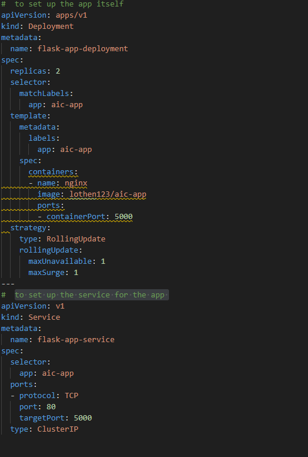
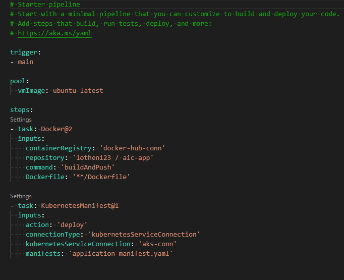

# Web-App-DevOps-Project

Welcome to the Web App DevOps Project repo! This application allows you to efficiently manage and track orders for a potential business. It provides an intuitive user interface for viewing existing orders and adding new ones.

## Table of Contents

- [Features](#features)
- [Getting Started](#getting-started)
- [Technology Stack](#technology-stack)
- [Containerisation](#containerisation)
- [Kubernetes deployment of application](#ckubernetes-deployment-of-application)
- [Contributors](#contributors)
- [License](#license)

## Features

- **Order List:** View a comprehensive list of orders including details like date UUID, user ID, card number, store code, product code, product quantity, order date, and shipping date. 
as of 24/12/2023, a new feature has been added for delivery date. However, this has been removed for now ready for future releases. 
  

- **Pagination:** Easily navigate through multiple pages of orders using the built-in pagination feature.
  

- **Add New Order:** Fill out a user-friendly form to add new orders to the system with necessary information.
  

- **Data Validation:** Ensure data accuracy and completeness with required fields, date restrictions, and card number validation.

## Getting Started

### Prerequisites

For the application to succesfully run, you need to install the following packages:

- flask (version 2.2.2)
- pyodbc (version 4.0.39)
- SQLAlchemy (version 2.0.21)
- werkzeug (version 2.2.3)

### Usage

To run the application, you simply need to run the `app.py` script in this repository. Once the application starts you should be able to access it locally at `http://127.0.0.1:5000`. Here you will be meet with the following two pages:

1. **Order List Page:** Navigate to the "Order List" page to view all existing orders. Use the pagination controls to navigate between pages.

2. **Add New Order Page:** Click on the "Add New Order" tab to access the order form. Complete all required fields and ensure that your entries meet the specified criteria.

## Technology Stack

- **Backend:** Flask is used to build the backend of the application, handling routing, data processing, and interactions with the database.

- **Frontend:** The user interface is designed using HTML, CSS, and JavaScript to ensure a smooth and intuitive user experience.

- **Database:** The application employs an Azure SQL Database as its database system to store order-related data.

## Containerisation

This application employs the use of Docker, to provide a container to move the application from one to another, regardless of operation system or platform. In order to recreate what was done to achieve this , the following was committed:
1. Created a Dockerfile and with the required configuration against the application to hold and move. this includes stating to use:
    - Using python3.8 as the base image for docker to use
    - Copy all contents of the application into docker under a directory as "/app".
    - Ensure both the app.py python file and the requirements file ( contains the dependant python libraries needed) are specified in the /app folder in docker.
    - Run a set of command to use the debian linux OS as well as initalise the ODBC connection.
    - Run pip install to get the update tools library 
    - Run pip install to get the libraries based on the requirements.txt text file. 
    - Ensure that port 5000 is used to be able to access the application created. 
    - Set the entrypoint to be python3 so docker recognises the application to run from this environment. 
    - Finally - upon running the docker build -  to launch the application. 

2. Executed following command in command prompt to containerise the application: docker build -t aic-app:latest .
3. Then, the following command in command prompt to test the build using : docker run -p 5000:5000 aic-app  

## Infrastructure as code (IAC)
This project utilises the use of Terraform to deploy the containerised application onto a Azure Kubernetes Cluster to ensure application stability.

### Networking 
a module has been created to set up the resources needed to be deployed into Azure:
- A resource Group - named aic-app-ntw-lo where all other components will be housed under.
- A Virtual Network (Vnet) where the application and Kubernetes cluster will run from,
- Control and work subnets within the Vnet.
- A Network Security Group to manage access to and from this application with rules on ssh and the lkubeapi server.
- input variables include resource group name, cloud location, and vnet adress space.
- out variables include vnet id, control and worker node id's, networking resource group name, and networking security group id.

### aks-cluster
a module has been create to set up the azure kubernetes cluster required to be set up in azure:
- azurerm_kubernetes_cluster named aks-cluster.
- a default_node_pool to configure said cluster.
- and a the service principal details needed to access it.
- variables declared for the cluster name, location, dns-prefix, the version of kubernetes, service principal details.
- additionally, variables retrieved from the output of the networking module for vnet control and worker node ids as well as the resource group name to use.

## when deploying iac to azure
something to be aware of when your build is ready - with both networking and aks-cluster modules - set up. Azure may need some additional assistance before you deploy it ( especially in my case, as i have another azure subscription elsewhere).

### 1. Terminal commands 
before we begin to deploy anything to azure , the following commands in the terminal need to be set ( i did the in terminal within the VScode terminal with my active folder open):

1. az login --tenant 47d4542c-f112-47f4-92c7-a838d8a5e8ef --allow-no-subscriptions
This is so that you are logged into azure and pointing at the AICore tenant only

2. az account set --subscription sub-is-here
so the azure is looking at your subscription to AICORE only 

3. az ad sp create-for-rbac --name enter_name_here --role contributor --scopes /subscriptions/sub-id-here
so that you create a service principal id and password . PLEASE NOTE!: you need to save the appid and password down, as is needed to be used within the Terraform configuration you have set up.

Now this is completed, the next step is to initalise the relevant terraform folders before deployment.

### 2. Initialising Terraform folders
One last thing before deployment, we need to initalise the relevant folders in terraform, so the configuration is ready for deployment. Please follow the steps below:

In the folder directory for the networking module , enter terraform init.
Once completed, got into the folder directory for the aks-0cluster module , open a terminal there and type terraform init. Lastly, go into the directory above - where both directories are under - open a terminal , and enter terraform init. 

### 3. apply configuration and deploy to azure.
Lastly now the previous steps above are complete. under the main directory, open a terminal, and type terraform apply. Enter yes once the review is done of the stuff to implement and hit enter. NOTE, for me at least i had to do this twice , as first time it failed saying there is no resource group in there, even though the resource group was created !? ( timing issue maybe). Re run this command again, and ( for me at least) this appears to work!

### 4. get kube config credentials. 
finally, we need to get the credentials of our kubernetes cluster created in order to access it later. to do this got to the terminal window and enter: az aks get-credentials --resource-group-name --name cluster-name 

## Kubernetes deployment of application
Now that the terraform configuration has been completed to deploy a kubernetes cluster onto Microsoft Azure, we can can now deploy the app onto. For this to happen a yaml file is created called application-manifest.yaml. In this file are two sections of code:

1. Section for the flask-app-deployment: to set up the app itself.
    - Set up to run two replicas for scalability and high availability.
    - Connected to previously created docker image where the app code resides.
    - Exposed port 5000 for communications with the azure kubernetes cluster. 
    - Implemented a Rolling update deployment strategy, for seamless application updates, with a maximum of one pod to deploy while one is unavailable.

    
2. Section for the flask-app-service: to set up the service for the app.
    - Configure service to use TCP protocol via port 80 for internal communication with the cluster.
    - Targetport to be house on 5000, corresponding to an example port exposed on the docker container.
    - Set the service type to CLuster IP, to designate as an internal service to the azure kubernetes cluster.

for this to be achieved, below is a screenshot of the file application-manifests.yaml:
 

 Once code is created and saved, then use the following commands within the terminal ( ensure you are still connected to azure via az login):
1. kubectl config get-contexts: to ensure you are looking / connected to the right context to apply the app deployment.

2. kubectl apply -f application-manifest.yaml: to deploy said file, if successful, will read something similar to  -  "deployment.apps/flask-app-deployment created"

3. kubectl get pods: to check that pods have now been created for your deployment

4. finally, to check the app is working as expected : kubectl port-forward flask-app-deployment-785dd4954-9bxvj 5000:5000 and then in your browser, go to : http://127.0.0.1:5000/ ( or equivalent based on setup), and test the web app and ensure everything is working as expected.

5. carry out some test including page navigation and button clicks, as well as adding a new order.

## Automated Deployment into Azure DevOps
Now that the application has now been deployed via the kubernetes cluster we set up previously, and tested the web app to ensure it is wokring as expected, the next step is to set up Continuous Integration / Continuous Deployment (CI/CD). To facilitate this, the following steps are to be taken :

- Set up an organisation and poject within Azure DevOps.
- Set up service connections for Docker hub and the Azure Kubernetes connection set up previously
- Create and run the following pipeline, to set up CI/CD when any changes are made to the main branch:

## Contributors 

- [Maya Iuga]([https://github.com/yourusername](https://github.com/maya-a-iuga))
- [Louis Othen]([https://github.com/lou-i0/Web-App-DevOps-Project-LO])

## License

This project is licensed under the MIT License. For more details, refer to the [LICENSE](LICENSE) file.
